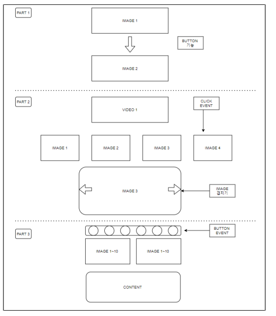

# 창덕궁 달빛기행
---
## [Web Front-end Project] 

- 요약 : 도심 속 문화 기행을 주제로 "창덕궁 달빛기행" 웹 프론트엔드 구현.

- Code Source : https://github.com/bkk91/culturalTrip

- 언어 : html (+ css) 

- 통합 개발 환경(IDE) : Visual Studio Code (ver. March 2021)

- 내용 : 비트컴퓨터 국비 교육과정, 웹 프론트엔드 과정 중 웹페이지 기획 및 구현을 팀 별로 작업.

---
### 프로젝트 플랜 (Project plan)

 <b> 1. 기획 (Outline) </b> 

 
- 주제 선정 : 현 수준에서 구현할 수 있는 직관적이고 접근용이한 주제를 선정.
- 디자인 컨셉: 달빛 기행이라는 주제 속에서 전체적으로 은은하고 어두운 분위기를 연출.
- 개발 방식 : Agile / scrum 방식을 활용하여 정해진 날짜 까지 반응형 기능을 구현 및 6명의 인원르 각각 2명씩 나누어 짝코딩.  

 
 
 

 <b> 2. 화면설계 (Analysis) </b> 

- 화면 설계는 app.diagrams.net에서 기본 설계도를 작성 후  https://jeongyunlee.github.io/2021-Earthday/index.html 의 구성을 참고,
- 주제에 관련하여 내용은 한국문화재단에서 제공하는(https://www.chf.or.kr/) 창덕궁 정보를 참고. 
- 반응형 기능들은 https://www.webjangi.com/ 를 참고하여 디자인에 맞게 구성.

 

 <b> 3. 화면구현 (Design) </b> 

 
###### Header

- 창덕궁 달빛기행이라는 주제에 맞추어 밤하늘의 어두운 분위기를 배경으로, 텍스트를 밝은색으로 구성하여 대조적인 느낌으로 헤더 구성

###### Section A

- 달빛기행 프로그램의 전반적인 구성내용을 함축하는 동영상 첨부

###### Section B

- 창덕궁에서 제공하는 행사의 내용을 사진 (반응형)으로 구성

###### Section C

- 야간 관람시 각 장소의 위치를 버튼식으로 구성

###### Section D

- 찾아오는 길을 이미자 파일 업로드를 통해 간략히 소개

###### Footer

- 팀원 소개 및 여러 링크들을 걸어 푸터 구성

 

 <b> 4. 평가 (Embody) </b> 

 프로젝트를 시작하기에 앞서, 웹에 관련된 수업을 배우면서 내가 할 수 있을까?에 대한 고민이 많았다.

팀장으로서 팀을 구성하고 주제를 회의하며 서로에 대한 다양한 생각의 접점을 맞추는 과정에서
 
 <b>하고 싶은 기능</b>과 <b>할 수 있는 기능</b>의 분류를 하고 
 
 기간이 정해진 프로젝트이기 때문에 <b>기능에 대한 priority</b>를 선정하여 구현 순서를 정했다.

파트를 나누고 각자 작업한 파일을 합치는 과정 또한 험난했다. 

사실, github의 branch기능을 활용하지 못하는 상태였기 때문에 

filezilla의 version별 업데이트를 통해 매일매일 모두 작업한 기능을 취합하고 작업하기 전 재 분류하였다. 

생각보다 분류 작업을 통해 소요되는 시간이 많고 내게 할당된 파트까지 작업했기 때문에 시간에 걸쳐 겨우 마무리하였다.

BRANCH기능을 통해 손쉽게 취합을 했다면? 내가 조금더 css에 대하여 익숙했더라면? 하는 아쉬움이 많이 남는 프로젝트였다.

 

---
